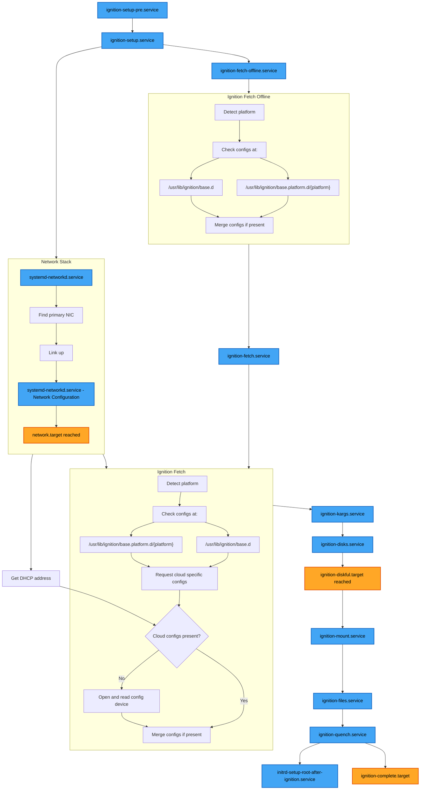

```mermaid
flowchart TB
    %% ===== IGNITION BOOT FLOW =====
    
    %% --- Early Boot ---
    setup_pre["ignition-setup-pre.service"] --> setup["ignition-setup.service"]
    setup --> fetch_offline["ignition-fetch-offline.service"]
    
    %% --- Fetch Offline Details ---
    subgraph FETCH_OFFLINE ["Ignition Fetch Offline"]
        direction TB
        offline_detect_platform["Detect platform"]
        offline_check_configs["Check configs at:"]
        offline_base_dir["/usr/lib/ignition/base.d"]
        offline_platform_dir["/usr/lib/ignition/base.platform.d/{platform}"]
        offline_detect_platform --> offline_check_configs
        offline_check_configs --> offline_base_dir
        offline_check_configs --> offline_platform_dir
        offline_merge_configs["Merge configs if present"]
        offline_base_dir --> offline_merge_configs
        offline_platform_dir --> offline_merge_configs
    end
    fetch_offline --> FETCH_OFFLINE
    
    FETCH_OFFLINE --> fetch_service["ignition-fetch.service"]
    
    %% --- Fetch Service Details ---
    subgraph FETCH_ONLINE ["Ignition Fetch"]
        direction TB
        online_detect_platform["Detect platform"]
        online_check_configs["Check configs at:"]
        online_base_dir["/usr/lib/ignition/base.d"]
        online_platform_dir["/usr/lib/ignition/base.platform.d/{platform}"]
        online_detect_platform --> online_check_configs
        online_check_configs --> online_base_dir
        online_check_configs --> online_platform_dir
        online_request_cloud_configs["Request cloud specific configs"]
        online_cloud_configs_present{"Cloud configs present?"}
        online_use_cloud_configs["Merge configs if present"]
        online_open_config_device["Open and read config device"]
        online_base_dir --> online_request_cloud_configs
        online_platform_dir --> online_request_cloud_configs
        online_request_cloud_configs --> online_cloud_configs_present
        online_cloud_configs_present -->|Yes| online_use_cloud_configs
        online_cloud_configs_present -->|No| online_open_config_device
        online_open_config_device --> online_use_cloud_configs
    end
    fetch_service --> FETCH_ONLINE
    
    %% --- Network Stack ---
    subgraph NETWORK ["Network Stack"]
        direction TB
        networkd_service["systemd-networkd.service"]
        find_primary_nic["Find primary NIC"]
        link_up["Link up"]
        network_config["systemd-networkd.service - Network Configuration"]
        network_target["network.target reached"]
        networkd_service --> find_primary_nic --> link_up --> network_config --> network_target
    end
    setup --> NETWORK
    NETWORK --> FETCH_ONLINE
    NETWORK --> get_dhcp_address["Get DHCP address"]
    get_dhcp_address --> online_cloud_configs_present

    
    %% --- Disk & Mount Services ---
    FETCH_ONLINE --> kargs_service["ignition-kargs.service"]
    kargs_service --> disks_service["ignition-disks.service"]
    disks_service --> diskful_target["ignition-diskful.target reached"]
    diskful_target --> mount_service["ignition-mount.service"]
    
    %% --- Files & Users ---
    mount_service --> files_service["ignition-files.service"]
    files_service --> quench_service["ignition-quench.service"]
    quench_service --> initrd_setup_root["initrd-setup-root-after-ignition.service"]
    quench_service --> complete_target["ignition-complete.target"]
    
    %% ===== STYLING =====
    classDef service fill:#42a5f5,stroke:#1565c0,stroke-width:2px,color:#000
    classDef target fill:#ffa726,stroke:#e65100,stroke-width:2px,color:#000
    
    class setup_pre,setup,fetch_offline,fetch_service,kargs_service,disks_service,mount_service,files_service,quench_service,initrd_setup_root,network_config,networkd_service service
    class diskful_target,complete_target,network_target target
```