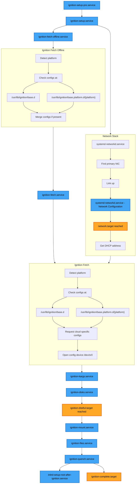

```mermaid
flowchart TB
    %% ===== IGNITION BOOT FLOW =====
    
    %% --- Early Boot ---
    A["ignition-setup-pre.service"] --> B["ignition-setup.service"]
    B --> C["ignition-fetch-offline.service"]
    
    %% --- Fetch Offline Details ---
    subgraph FETCH_OFFLINE ["Ignition Fetch Offline"]
        direction TB
        C0["Detect platform"]
        C1["Check configs at:"]
        C2["/usr/lib/ignition/base.d"]
        C3["/usr/lib/ignition/base.platform.d/{platform}"]
        C0 --> C1
        C1 --> C2
        C1 --> C3
        C4["Merge configs if present"]
        C2 --> C4
        C3 --> C4
    end
    C --> FETCH_OFFLINE
    
    FETCH_OFFLINE --> D["ignition-fetch.service"]
    
    %% --- Fetch Service Details ---
    subgraph FETCH_ONLINE ["Ignition Fetch"]
        direction TB
        D0["Detect platform"]
        D1["Check configs at:"]
        D1a["/usr/lib/ignition/base.d"]
        D1b["/usr/lib/ignition/base.platform.d/{platform}"]
        D0 --> D1
        D1 --> D1a
        D1 --> D1b
        D2["Request cloud specific configs"]
        D3["Open config device /dev/sr0"]
        D1a --> D2
        D1b --> D2
        D2 --> D3
    end
    D --> FETCH_ONLINE
    
    %% --- Network Stack ---
    subgraph NETWORK ["Network Stack"]
        direction TB
        N1["systemd-networkd.service"]
        N2["Find primary NIC"]
        N3["Link up"]
        N4["systemd-networkd.service - Network Configuration"]
        N5["network.target reached"]
        N6["Get DHCP address"]
        N1 --> N2 --> N3 --> N4 --> N5 --> N6
    end
    B --> NETWORK
    NETWORK --> FETCH_ONLINE
    
    %% --- Disk & Mount Services ---
    FETCH_ONLINE --> E["ignition-kargs.service"]
    E --> F["ignition-disks.service"]
    F --> G["ignition-diskful.target reached"]
    G --> H["ignition-mount.service"]
    
    %% --- Files & Users ---
    H --> I["ignition-files.service"]
    I --> J["ignition-quench.service"]
    J --> K["initrd-setup-root-after-ignition.service"]
    J --> L["ignition-complete.target"]
    
    %% ===== STYLING =====
    classDef service fill:#42a5f5,stroke:#1565c0,stroke-width:2px,color:#000
    classDef target fill:#ffa726,stroke:#e65100,stroke-width:2px,color:#000
    classDef ideas fill:#fff59d,stroke:#f57f17,color:#000
    classDef concerns fill:#ef9a9a,stroke:#c62828,color:#000
    
    class A,B,C,D,E,F,H,I,J,K,N4 service
    class G,L,N5 target
```