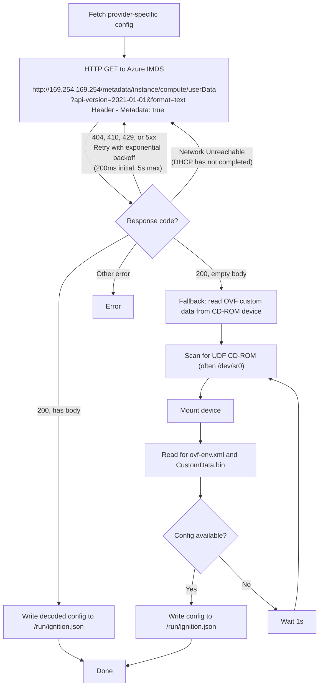

```mermaid
flowchart TB
    %% ===== IGNITION BOOT FLOW =====

    %% --- GRUB Firstboot Detection ---
    boot["Boot"] --> grub["GRUB bootloader"]

    subgraph GRUB_FIRSTBOOT ["GRUB Firstboot Detection"]
        direction TB
        grub_check{"/ignition.firstboot
        stamp file on bootfs?"}
        grub_check -->|Yes| grub_source["Source /ignition.firstboot
        (may set ignition_network_kcmdline)"]
        grub_source --> grub_append["Append to kernel cmdline:
        ignition.firstboot $ignition_network_kcmdline"]
        grub_check -->|No| grub_no_flag["No ignition.firstboot on cmdline"]
    end
    grub --> GRUB_FIRSTBOOT

    %% --- Initramfs Generator ---
    GRUB_FIRSTBOOT --> generator["ignition-generator
    (reads /proc/cmdline)"]
    generator --> firstboot_check{"ignition.firstboot
    on kernel cmdline?"}

    %% --- Subsequent Boot Path ---
    firstboot_check -->|No| subsequent_target["ignition-subsequent.target"]
    subsequent_target --> subsequent_diskful["ignition-diskful-subsequent.target"]
    subsequent_diskful --> subsequent_done["Ignition services do not run.
    Boot continues normally."]

    %% --- Firstboot Path ---
    firstboot_check -->|Yes| complete_gate["ignition-complete.target activated"]
    complete_gate --> setup_pre["ignition-setup-pre.service"]
    setup_pre --> setup["ignition-setup.service"]
    setup --> fetch_offline["ignition-fetch-offline.service"]

    %% --- Fetch Offline Details ---
    subgraph FETCH_OFFLINE ["Ignition Fetch Offline"]
        direction TB
        offline_detect_platform["Detect platform"]
        offline_check_configs["Check configs at:"]
        offline_base_dir["/usr/lib/ignition/base.d"]
        offline_platform_dir["/usr/lib/ignition/base.platform.d/{platform}"]
        offline_detect_platform --> offline_check_configs
        offline_check_configs --> offline_base_dir
        offline_check_configs --> offline_platform_dir
        offline_check_user_ign{"/usr/lib/ignition/user.ign exists?"}
        offline_base_dir --> offline_check_user_ign
        offline_platform_dir --> offline_check_user_ign
        offline_check_user_ign -->|Yes| offline_copy_user_ign["Write to /run/ignition.json"]
        offline_check_user_ign -->|No| offline_done["Done"]
        offline_copy_user_ign --> offline_done
    end
    fetch_offline --> FETCH_OFFLINE
    
    FETCH_OFFLINE --> fetch_check{"/run/ignition.json exists?"}
    fetch_check -->|Yes, skip ignition-fetch.service| kargs_service
    fetch_check -->|No| fetch_service["ignition-fetch.service"]
    
    %% --- Fetch Service Details ---
    subgraph FETCH_ONLINE ["Ignition Fetch"]
        direction TB
        online_detect_platform["Detect platform"]
        online_check_configs["Check configs at:"]
        online_base_dir["/usr/lib/ignition/base.d"]
        online_platform_dir["/usr/lib/ignition/base.platform.d/{platform}"]
        online_detect_platform --> online_check_configs
        online_check_configs --> online_base_dir
        online_check_configs --> online_platform_dir
        online_fetch_provider["Fetch provider-specific configs (see Provider Specific Behavior - Config Fetch below)"]
        online_check_user_ign{"/usr/lib/ignition/user.ign exists?"}
        online_base_dir --> online_check_user_ign
        online_platform_dir --> online_check_user_ign
        online_check_user_ign -->|Yes| online_write_config["Write config to /run/ignition.json"]
        online_check_user_ign -->|No| online_fetch_provider
        online_write_config --> online_done["Done"]
        online_fetch_provider -->|Config found| online_write_config
        online_fetch_provider -->|No config| online_done
    end
    fetch_service --> FETCH_ONLINE
    
    %% --- Network Stack ---
    subgraph NETWORK ["Network Stack"]
        direction TB
        networkd_service["systemd-networkd.service"]
        network_config["systemd-networkd.service - Network Configuration"]
        network_target["network.target reached"]
        networkd_service -->  network_config --> network_target
    end
    setup --> NETWORK
    NETWORK --> FETCH_ONLINE
    NETWORK --> get_dhcp_address["Get DHCP address"]
    get_dhcp_address --> online_fetch_provider
    
    %% --- Disk & Mount Services ---
    FETCH_ONLINE --> kargs_service["ignition-kargs.service"]
    kargs_service -->|kargs changed| reboot_kargs["Reboot & restart from top"]
    
    kargs_service -->|no changes| disks_service["ignition-disks.service"]
    disks_service --> diskful_target["ignition-diskful.target reached"]
    diskful_target --> mount_service["ignition-mount.service"]
    
    %% --- Files ---
    mount_service --> files_service["ignition-files.service"]
    initrd_root_fs_target["initrd-root-fs.target"] --> afterburn_hostname_service["afterburn-hostname.service"]
    afterburn_hostname_service -.-> files_service
    
    %% --- Files Service Details ---
    subgraph FILES ["Ignition Files"]
        direction TB
        files_detect_platform["Detect platform"]
        files_check_configs["Check configs at:"]
        files_base_dir["/usr/lib/ignition/base.d"]
        files_platform_dir["/usr/lib/ignition/base.platform.d/{platform}"]
        files_detect_platform --> files_check_configs
        files_check_configs --> files_base_dir
        files_check_configs --> files_platform_dir
        files_base_dir --> files_check_run_json
        files_platform_dir --> files_check_run_json
        files_check_run_json{"/run/ignition.json exists?"}
        files_check_run_json -->|Yes| files_merge_all["Merge all detected configs and apply"]
        files_merge_all --> files_done["Done"]
        files_check_run_json -->|No| files_error["Error"]
    end
    files_service --> FILES
    
    FILES --> complete_target["ignition-complete.target reached"]
    
    complete_target --> delete_config["ignition-delete-config.service"]
    
    %% ===== STYLING =====
    classDef service fill:#42a5f5,stroke:#1565c0,stroke-width:2px,color:#000
    classDef target fill:#ffa726,stroke:#e65100,stroke-width:2px,color:#000
    
    class setup_pre,setup,fetch_offline,fetch_service,kargs_service,disks_service,mount_service,files_service,network_config,networkd_service,afterburn_hostname_service,delete_config service
    class diskful_target,complete_target,complete_gate,network_target,initrd_root_fs_target,subsequent_target,subsequent_diskful target

```

## Provider Specific Behavior
### Config Fetch
#### Azure

```mermaid
flowchart TB
    %% ===== AZURE PROVIDER-SPECIFIC CONFIG FETCH =====

    start["Fetch provider-specific config"] --> imds_request["HTTP GET to Azure IMDS
    http://169.254.169.254/metadata/instance/compute/userData
    ?api-version=2021-01-01&format=text
    Header - Metadata: true"]

    imds_request --> imds_retry{"Response code?"}
    imds_retry -->|"404, 410, 429, or 5xx
    Retry with exponential backoff
    (200ms initial, 5s max)"| imds_request
    imds_retry -->|"Network Unreachable
    (DHCP has not completed)"| imds_request
    imds_retry -->|200, empty body| fallback_ovf
    imds_retry -->|200, has body| write_config["Write decoded config to /run/ignition.json"]
    imds_retry -->|Other error| error["Error"]
    write_config --> done["Done"]

    fallback_ovf["Fallback: read OVF custom data from CD-ROM device"]
    fallback_ovf --> scan["Scan for UDF CD-ROM (often /dev/sr0)"]
    scan --> mount["Mount device"]
    mount --> read["Read for ovf-env.xml and CustomData.bin"]
    read --> available{"Config available?"}
    available -->|Yes| write_device["Write config to /run/ignition.json"]
    write_device --> done
    available -->|No| wait["Wait 1s"] --> scan
```